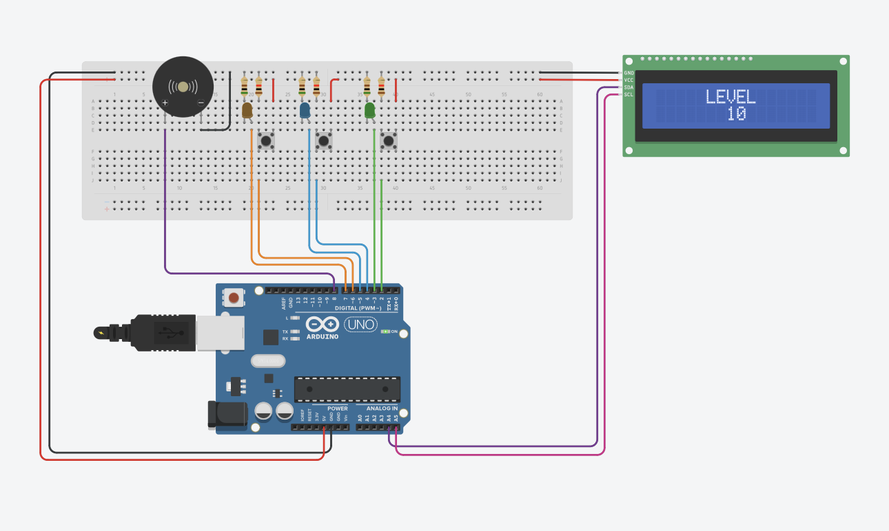
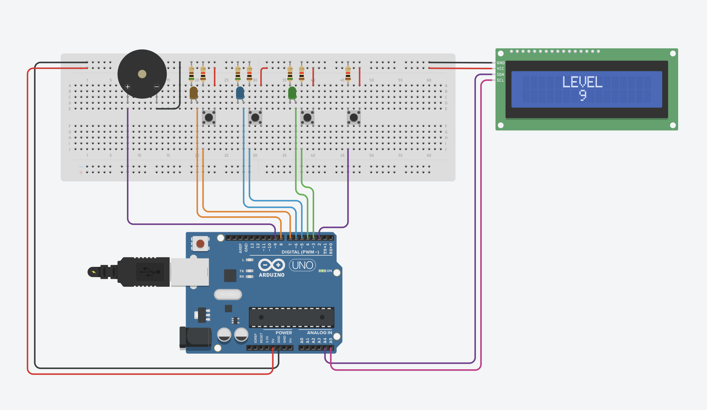

# Color Memory Game

This Arduino sketch implements a color memory game using LEDs, buttons, a buzzer, and an LCD with I2C. In this game, players must remember and repeat increasingly longer sequences of LED colors. The game provides visual, auditory, and textual feedback to the player throughout the gameplay.

# Circuit Diagram

## Game 1: Sequential Memory Game

In this variation of the color memory game, players need to remember and reproduce the entire sequence of LEDs that light up in each level. LEDs light up one at a time in a sequence, and players must press the corresponding buttons to reproduce the sequence. The game becomes progressively more challenging as the sequence grows longer with each level.

## Game 2: Reaction Time Game

In this variation of the color memory game, players don't need to remember the entire sequence of LEDs. Instead, LEDs light up one at a time in a repeating sequence, and players must quickly respond by pressing the corresponding button for each LED as it lights up. The game speeds up with each level, challenging the player's reaction time.

## Features

- Generates random sequences of LED colors for players to remember.
- Uses buttons for player input to repeat the sequences.
- Provides sound effects using a buzzer for enhanced gameplay experience.
- Displays the current level on an LCD screen using I2C communication.

## Components Used

- LEDs: Represent different colors in each game variation.
- Buttons: Players press buttons corresponding to the LEDs to respond to each game variation's requirements.
- Buzzer: Provides sound effects for game feedback, such as the Pirates of the Caribbean theme and game over melody.
- LCD with I2C: Displays the current level of each game variation using I2C communication.

## Usage

- **Sequential Memory Game**: Remember and reproduce the entire sequence of LEDs that light up in each level by pressing the corresponding buttons.
- **Reaction Time Game**: Quickly press the corresponding button for each LED as it lights up in a repeating sequence. The game speeds up with each level, challenging your reaction time.

## Setup

1. Connect LEDs, buttons, buzzer, and LCD to your Arduino board according to the pin assignments defined in the code for each game variation.
2. Upload the provided Arduino sketches (`SequentialMemoryGame.ino` and `ReactionTimeGame.ino`) to your Arduino board using the Arduino IDE or any compatible IDE.
3. Power up your Arduino board and start playing the color memory games!

## Contributors

- [Abdelghani Yacine BARKA](https://github.com/decodevm)
- [Nardjes Sara KHIAT](https://github.com/Nardjes03)

## Contributing

Contributions to this color memory game project are welcome! If you have any ideas for improvements or new features, feel free to open an issue or submit a pull request.

## Footer

This README provides an overview of the third TP (Travaux Pratiques) assignment for the ARDUINO course in the Master 1 Software Engineering program at the University of Tlemcen, during the 2023/2024 academic year.

## License

This project is licensed under the MIT License - see the [LICENSE](LICENSE) file for details.

