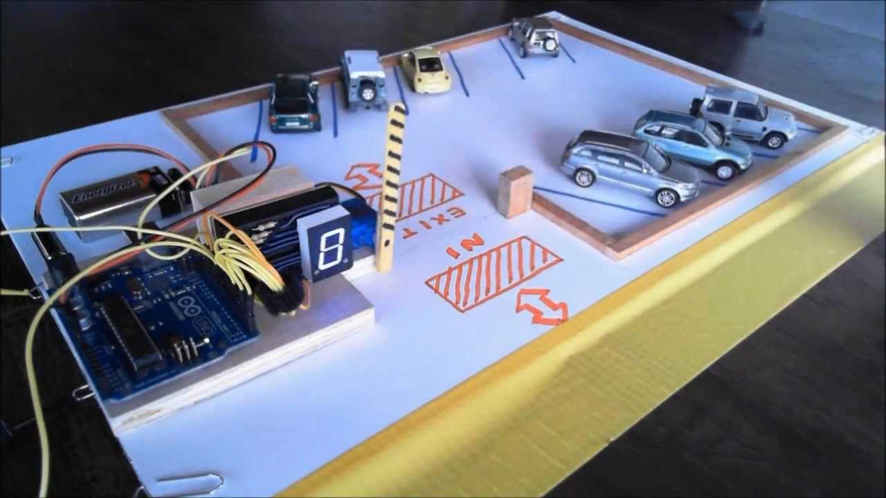
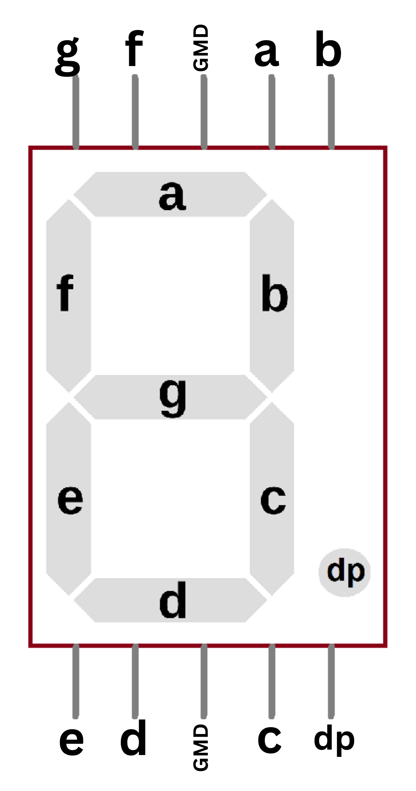

# Smart Parking System

## Overview

The Smart Parking System project aims to automate parking space management using Arduino technology. This system incorporates an LDR (Light Dependent Resistor) sensor, a servo motor, a 7-segment display, an IR (Infrared) sensor, an IR remote control, and a buzzer. It detects vehicle presence, controls parking barriers, displays parking space availability in real-time, and allows admin access to open and close the parking barriers using the IR remote control.

## Features

- **Vehicle Detection:** The LDR sensor detects the presence of vehicles entering or leaving parking spaces.
- **Automated Barrier Control:** The servo motor automatically opens and closes parking barriers based on vehicle presence.
- **Real-time Status Display:** A 7-segment display provides visual feedback on parking space availability.
- **Admin Access Control:** The admin can open and close parking barriers using an IR remote control.
- **Audible Feedback:** A buzzer provides auditory feedback when the admin opens or closes the parking barriers.

## Components Used

- Arduino board (e.g., Arduino Uno)
- LDR sensor
- Servo motor
- 7-segment display
- IR sensor
- IR remote control
- Buzzer
- Jumper wires
- Breadboard

## 7-Segment Display

<table>
    <tr>
        <td valign="top">
            <h3>Pinout:</h3>
            

                the 7-segment display has 10 pins, 8 of which are used to control the individual LED segments (A-G and DP), and the remaining 2 pins are used to control the common anode or cathode. 
                The common pin is connected to the positive voltage (VCC) for common anode displays or to the ground (GND) for common cathode displays. 
            

        </td>
        <td align="right"></td>
    </tr>
</table>

## How it Works

1. **Vehicle Detection:** The LDR sensor detects changes in light intensity caused by vehicles entering or leaving parking spaces.
2. **Barrier Control:** The Arduino board processes the sensor data and commands the servo motor to open or close the parking barrier accordingly.
3. **Status Display:** Simultaneously, the Arduino updates the status of the parking space on the 7-segment display, indicating whether it is vacant or occupied.
4. **Admin Access Control:** The IR sensor detects signals from the IR remote control. The admin can use specific codes to open and close the parking barriers remotely.
1. **Audible Feedback:** When the admin successfully opens or closes the parking barriers, a buzzer provides auditory feedback.

## Circuit Diagram

## Getting Started

1. **Assembly:** Connect the LDR sensor, servo motor, 7-segment display, IR sensor, IR remote control, and buzzer to the Arduino board following the circuit diagram.
2. **Code Upload:** Upload the provided Arduino sketch to the board using the Arduino IDE.
3. **Power On:** Power the Arduino board and observe the Smart Parking System in action.

## Footer

This README provides an overview of the third TP (Travaux Pratiques) assignment for the ARDUINO course in the Master 1 Software Engineering program at the University of Tlemcen, during the 2023/2024 academic year.

## Contributors

- [Abdelghani Yacine BARKA](https://github.com/decodevm)
- [Tarik HAMMOUMI](https://github.com/ItsTarikBTW)
- [Mohammed Lhadi DIB](https://github.com/Lhadidib07)
- [Nardjes Sara KHIAT](https://github.com/Nardjes03)

## Contributions

Contributions to this project are welcome! If you'd like to make enhancements or report issues, please open a new issue or pull request.
