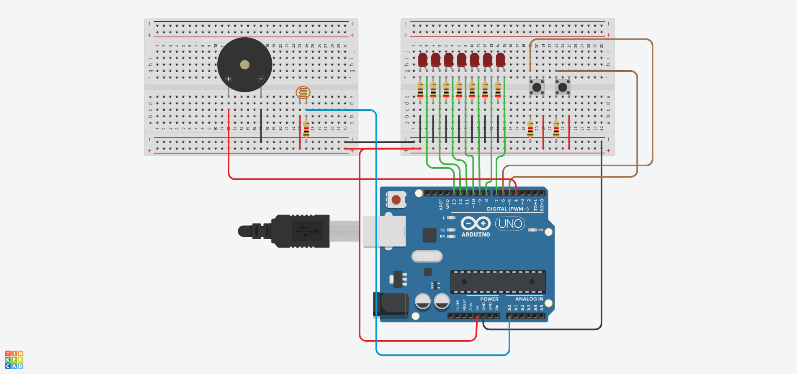

# Arduino GL Exam 29/05/2024

## Circuit View

## Subject

Using 7 LEDs and 2 buttons a buzzer and a light sensor. 
- Create a circuit that starts with all LEDs off and the buzzer silent. 
- Button 1 is used to turn on the next LED in the sequence and turn off the previous one looping back to the first LED after the last one.
- Button 2 is used to buzz the buzzer for K time where K is the index of the LED that is currently on.(starting from 1).
- The light sensor does the same thing as button 1 when the light level returns from a low value to a high value.

## Note

the pin 7 should be connected to the first LED from the left and so on.

## Contributors

- [Tarik HAMMOUMI](https://github.com/ItsTarikBTW)
- [Mohammed Lhadi DIB](https://github.com/Lhadidib07)

special thanks to how designed the circuit:
- [Abdelhamid KHELLADI](https://github.com/AbdelhamidKHELLADI)
- Mohammed Eddine Houssam BENDJAFER
